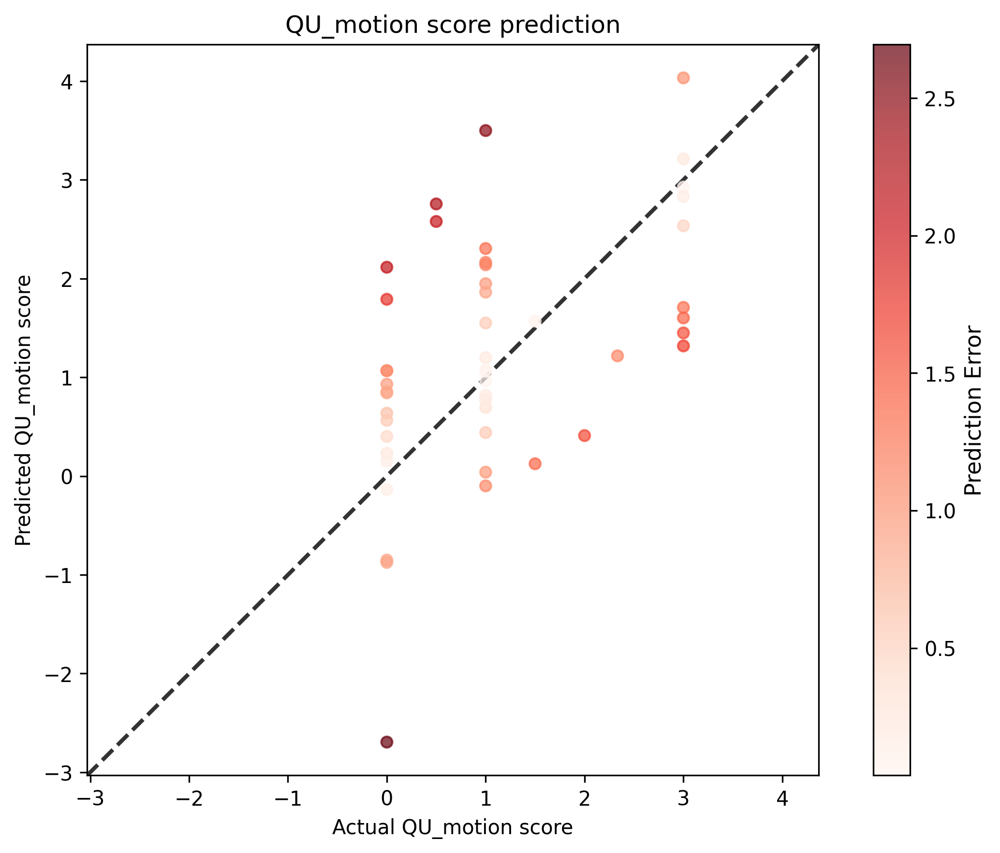

# QU Motion Score Analysis Results

## Statistical Metrics

| Metric | Value |
|--------|-------|
| Sample Size | 48 |
| RMSE | 1.1410 |
| Standardized RMSE | 1.0511 |
| Correlation (r) | 0.5134 |
| P-value | 1.9031e-04 |
| Standard Error | 1.1655 |

## Visualization

## Interpretation

- **Correlation**: 0.5134 indicates a moderate positive relationship between actual and predicted scores.
- **P-value**: 1.9031e-04 is statistically significant (p < 0.05).
- **Standardized RMSE**: 1.0511 represents the RMSE as a proportion of the standard deviation of the actual values.
