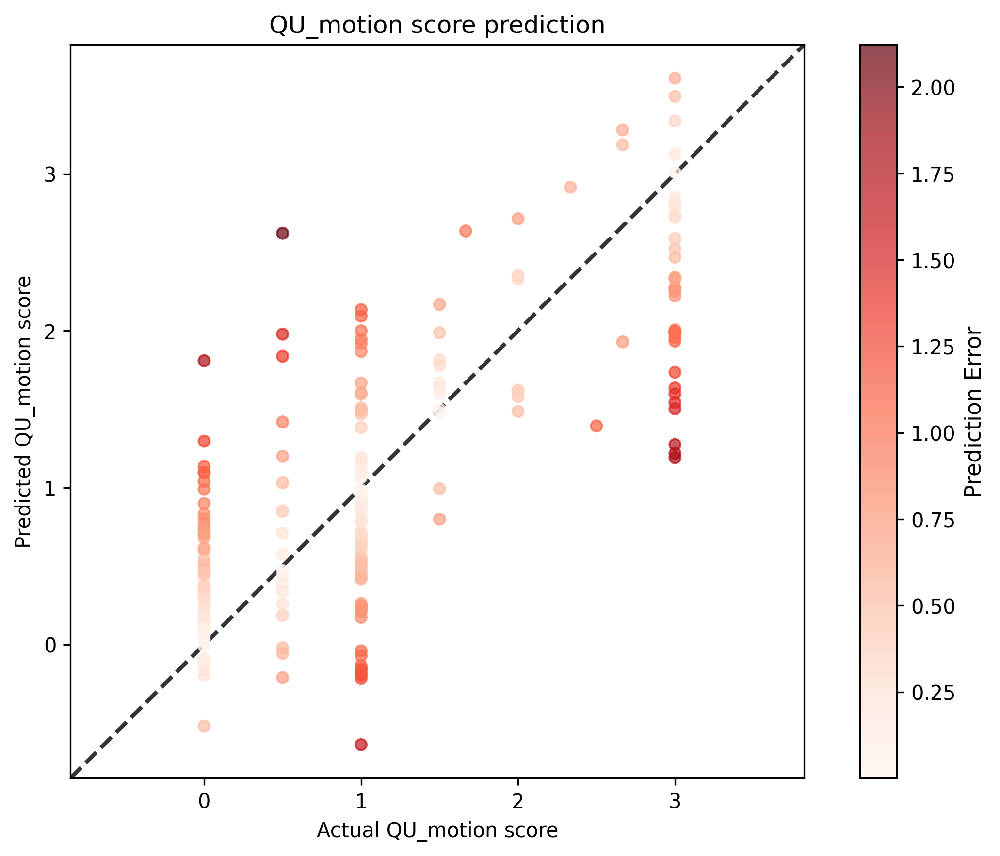

# QU Motion Score Analysis Results

## Statistical Metrics

| Metric | Value |
|--------|-------|
| Sample Size | 206 |
| RMSE | 0.6962 |
| Standardized RMSE | 0.6604 |
| Correlation (r) | 0.7612 |
| P-value | 3.1768e-40 |
| Standard Error | 0.6996 |

## Visualization

## Interpretation

- **Correlation**: 0.7612 indicates a strong positive relationship between actual and predicted scores.
- **P-value**: 3.1768e-40 is statistically significant (p < 0.05).
- **Standardized RMSE**: 0.6604 represents the RMSE as a proportion of the standard deviation of the actual values.
