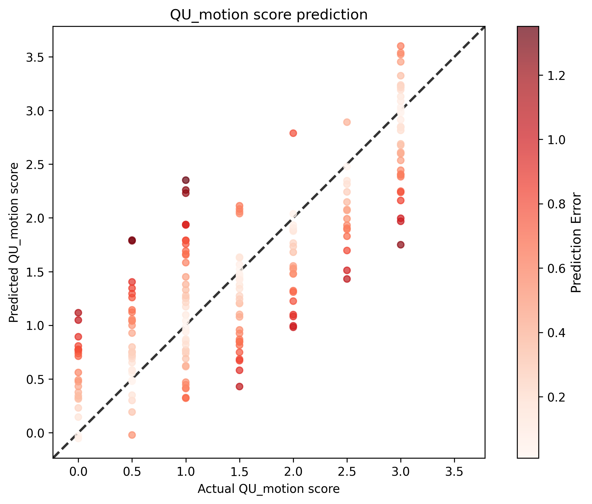
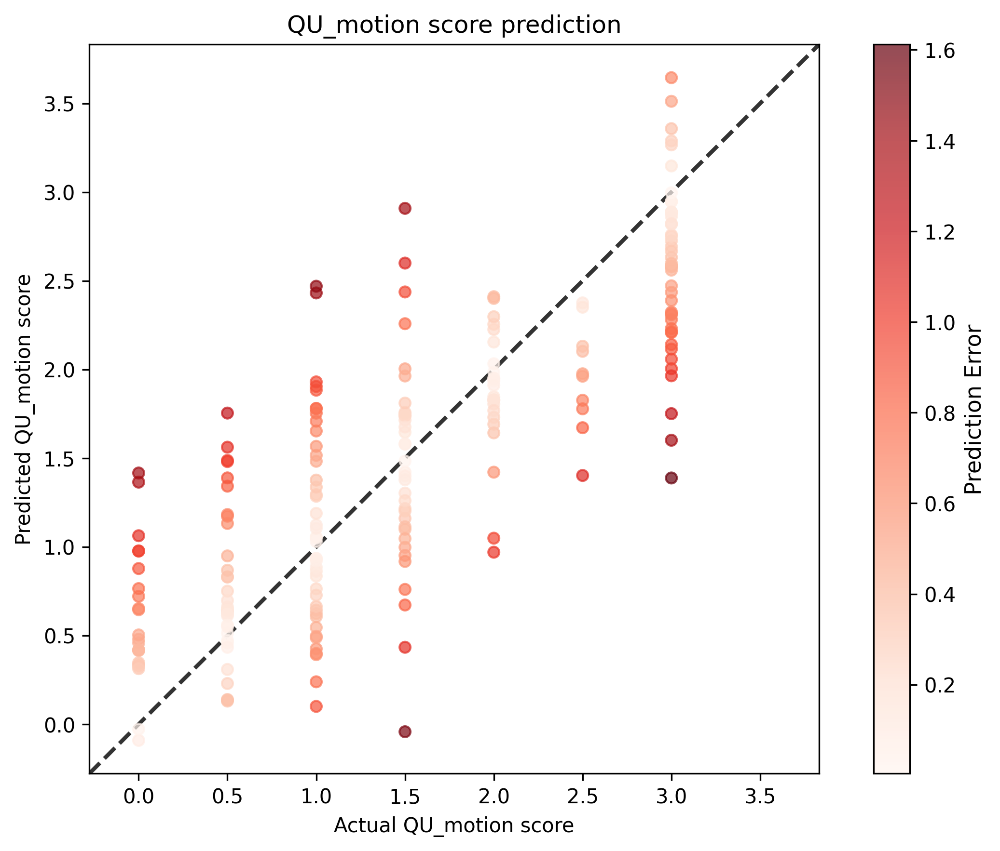
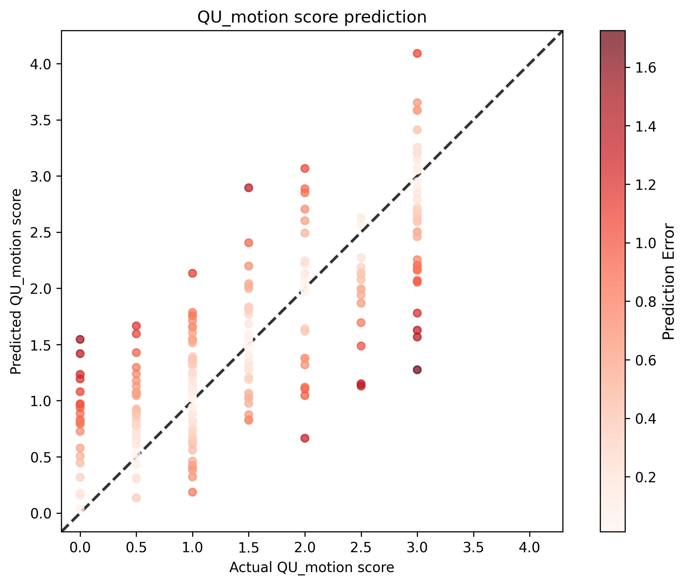
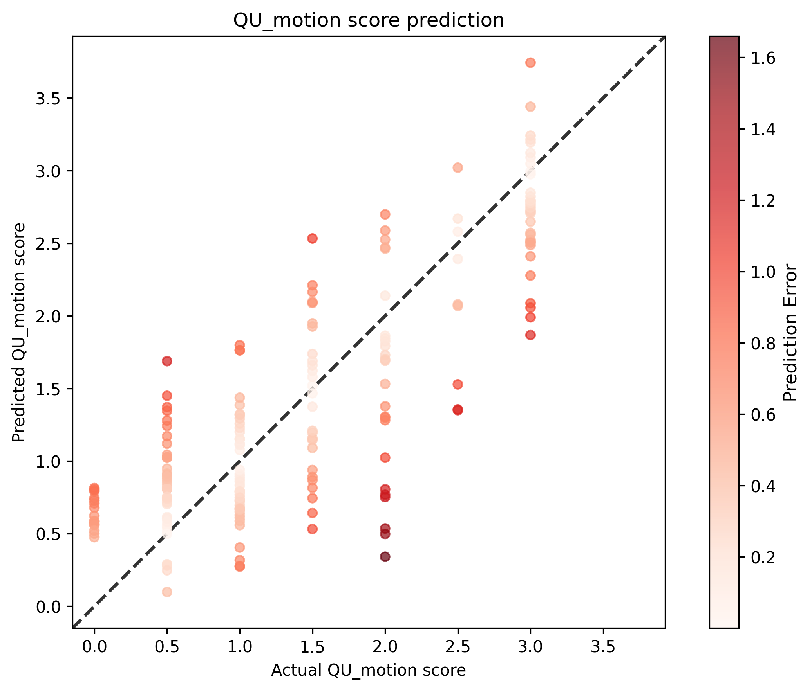
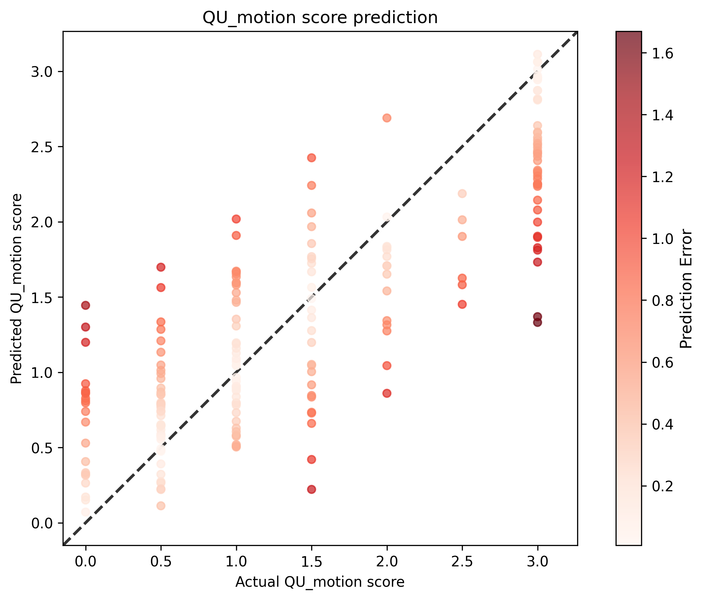

# QU Motion Score Analysis Results

## Statistical Metrics

| Metric | Value |
|--------|-------|
| Validation Sample Size | 1024 |
| RMSE | 0.5740 |
| Standardized RMSE | 0.5834 |
| Correlation (r) | 0.8125 |
| P-value | 1.0172e-241 |
| Standard Error | 0.5746 |

## 5-Fold Cross-Validation Details

| Metric | Value |
|--------|-------|
| Analysis Type | 5-Fold Cross-Validation |
| CSV Pattern | model_02r7_fold_*.csv |

## Visualizations (Per-Fold)

### Fold 0

### Fold 1

### Fold 2

### Fold 3

### Fold 4

## Interpretation

- **Correlation**: 0.8125 indicates a strong positive relationship between actual and predicted scores.
- **P-value**: 1.0172e-241 is statistically significant (p < 0.05).
- **Standardized RMSE**: 0.5834 represents the RMSE as a proportion of the standard deviation of the actual values.
- **Standard Error**: 0.5746 provides an estimate of the average distance that the observed values fall from the regression line.
## Hyperparameters

### Training Parameters

| Parameter | Value |
|-----------|-------|
| batch_size | 8 |
| epochs | 100 |
| lr | 0.001 |
| model | Regressor |
| num_workers | 12 |
| optimizer | Adam |
| scheduler | plateau |
| use_amp | True |

### Configuration

| Parameter | Value |
|-----------|-------|
| cpus_per_task | 16 |
| csv_input_file | $FOLD_CSV |
| csv_output_file | /users/1/lundq163/projects/automated-qc/doc/models/model_02r7/model_02r7_fold_${FOLD_IDX}.csv |
| folder | /scratch.global/lundq163/auto_qc/auto_qc_subset_1024r_fixed_scores/ |
| gres | gpu:a100:1 |
| job_name | fold_2_redo |
| mail_type | BEGIN,END,FAIL |
| mail_user | lundq163@umn.edu |
| mem | 128g |
| model_save_location | /scratch.global/lundq163/auto_qc/auto_qc_model_02r7/model_02r7_fold_${FOLD_IDX}.pt |
| ntasks | 1 |
| plot_location | /users/1/lundq163/projects/automated-qc/doc/models/model_02r7/model_02r7_fold_${FOLD_IDX}.png |
| tb_run_dir | /users/1/lundq163/projects/automated-qc/src/training/runs/ |
| time | 24:00:00 |
| use_train_validation_cols | \ |

