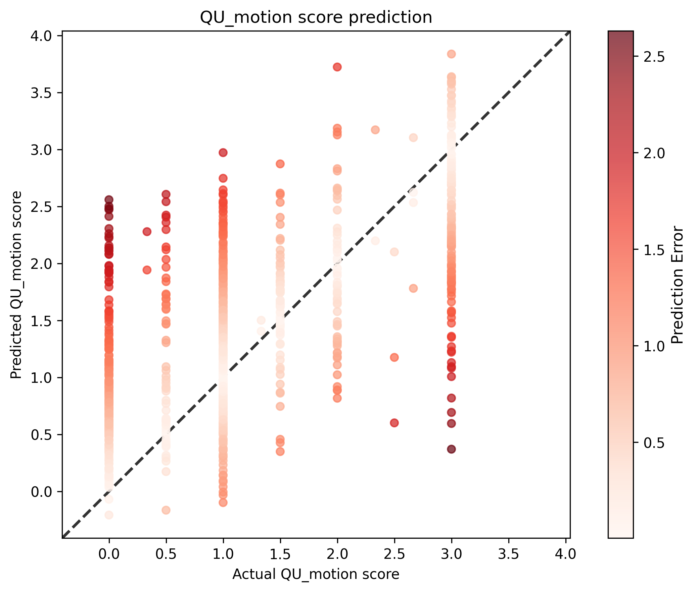

# QU Motion Score Analysis Results

## Statistical Metrics

| Metric | Value |
|--------|-------|
| Sample Size | 851 |
| RMSE | 0.8692 |
| Standardized RMSE | 0.8730 |
| Correlation (r) | 0.6096 |
| P-value | 9.9912e-88 |
| Standard Error | 0.8702 |

## Visualization

## Interpretation

- **Correlation**: 0.6096 indicates a moderate positive relationship between actual and predicted scores.
- **P-value**: 9.9912e-88 is statistically significant (p < 0.05).
- **Standardized RMSE**: 0.8730 represents the RMSE as a proportion of the standard deviation of the actual values.
