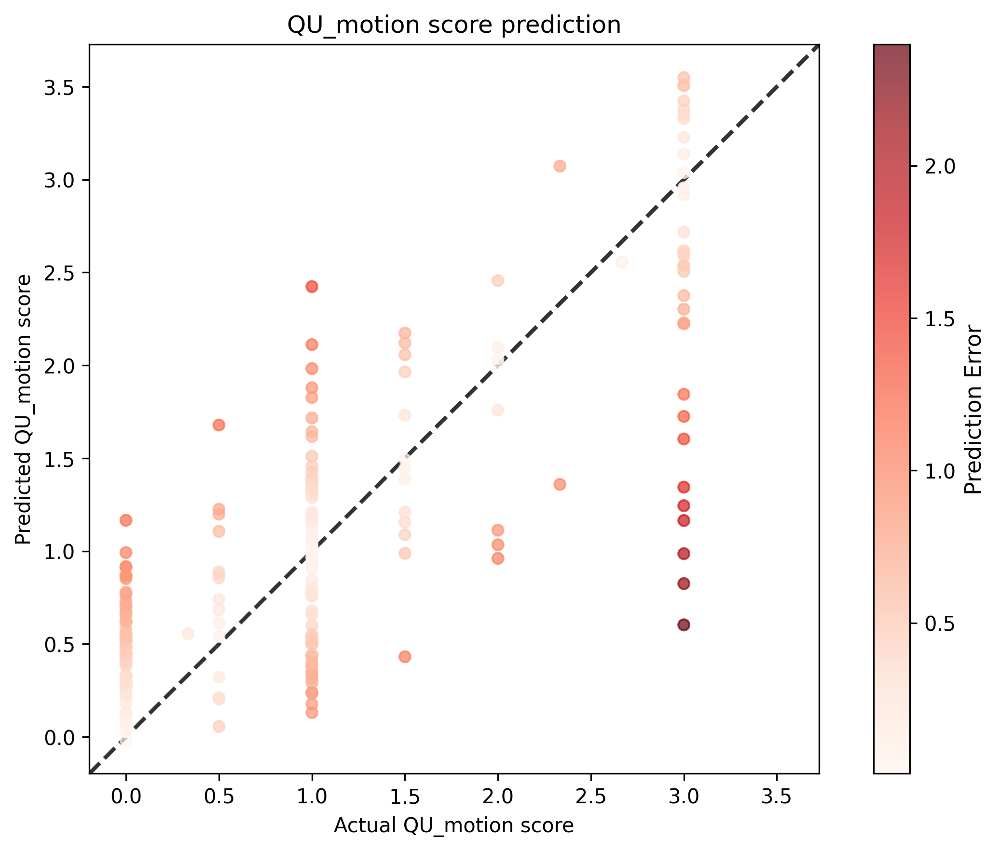

# QU Motion Score Analysis Results

## Statistical Metrics

| Metric | Value |
|--------|-------|
| Validation Sample Size | 207 |
| RMSE | 0.6255 |
| Standardized RMSE | 0.6194 |
| Correlation (r) | 0.7871 |
| P-value | 6.6569e-45 |
| Standard Error | 0.6286 |

## Visualization

## Interpretation

- **Correlation**: 0.7871 indicates a strong positive relationship between actual and predicted scores.
- **P-value**: 6.6569e-45 is statistically significant (p < 0.05).
- **Standardized RMSE**: 0.6194 represents the RMSE as a proportion of the standard deviation of the actual values.
## Notes

Utilizes smaller subset, preprocessing involves only registration (Affine+Rigid), and removes majority of scans where registration was poor. Run time was 23h 17m 09s
## Hyperparameters

### Training Parameters

| Parameter | Value |
|-----------|-------|
| batch_size | 8 |
| epochs | 100 |
| lr | 0.001 |
| model | Regressor |
| num_workers | 12 |
| optimizer | Adam |
| scheduler | plateau |
| split_strategy | stratified |
| train_split | 0.8 |
| use_amp | True |

### Configuration

| Parameter | Value |
|-----------|-------|
| cpus_per_task | 16 |
| csv_input_file | /users/1/lundq163/projects/automated-qc/data/raw/auto_qc_t1w_t2w_subset_1024r.csv |
| csv_output_file | /users/1/lundq163/projects/automated-qc/doc/models/model_02r/model_02r.csv |
| folder | /scratch.global/lundq163/auto_qc_subset_1024r/ |
| gres | gpu:a100:1 |
| job_name | automated-qc-Regressor |
| mail_type | end |
| mail_user | lundq163@umn.edu |
| mem | 128g |
| model_save_location | /scratch.global/lundq163/auto_qc_model_02r/model_02r.pt |
| ntasks | 1 |
| plot_location | /users/1/lundq163/projects/automated-qc/doc/models/model_02r/model_02r.png |
| tb_run_dir | /users/1/lundq163/projects/automated-qc/src/training/runs/ |
| time | 24:00:00 |

