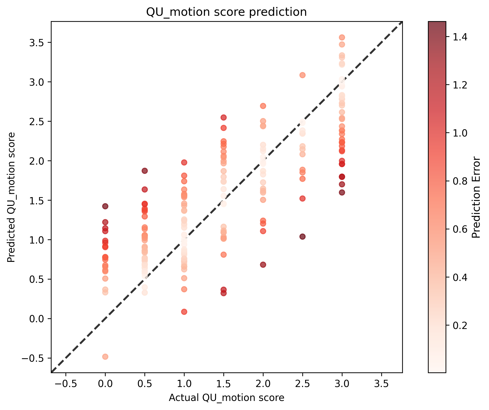

# QU Motion Score Analysis Results

## Statistical Metrics

| Metric | Value |
|--------|-------|
| Validation Sample Size | 213 |
| RMSE | 0.5833 |
| Standardized RMSE | 0.5859 |
| Correlation (r) | 0.8112 |
| P-value | 4.5542e-51 |
| Standard Error | 0.5861 |

## Sensitivity, Specificity, PPV, and NPV Analysis

| Threshold | Sensitivity | Specificity | PPV | NPV |
|-----------|-------------|-------------|-----|-----|
| 0.0 | 0.9953 | 0.0000 | 1.0000 | 0.0000 |
| 0.5 | 0.9689 | 0.1500 | 0.9167 | 0.3333 |
| 1.0 | 0.8289 | 0.6721 | 0.8630 | 0.6119 |
| 1.5 | 0.8426 | 0.8952 | 0.8922 | 0.8468 |
| 2.0 | 0.6625 | 0.9398 | 0.8689 | 0.8224 |
| 2.5 | 0.4286 | 0.9809 | 0.8889 | 0.8280 |
| 3.0 | 0.1707 | 0.9942 | 0.8750 | 0.8341 |

### Interpretation

Higher motion scores indicate more motion artifact (worse image quality). Thresholds represent the maximum acceptable motion score before flagging an image.

**Threshold Recommendations**:

- **Balanced (Threshold 1.5)**: Detects 84% of motion-corrupted images while maintaining 90% specificity. When flagged, 89% are true positives.
- **High Sensitivity (Threshold 1.0)**: Catches 83% of motion artifacts but rejects 33% of acceptable images.
- **High Specificity (Threshold 2.0)**: Minimizes false positives (94% specificity) but only catches 66% of motion artifacts.
**Key Observations**:

- High precision: When images are flagged at threshold 1.5, they're truly motion-corrupted 89% of the time.

## Visualization

## Interpretation

- **Correlation**: 0.8112 indicates a strong positive relationship between actual and predicted scores.
- **P-value**: 4.5542e-51 is statistically significant (p < 0.05).
- **Standardized RMSE**: 0.5859 represents the RMSE as a proportion of the standard deviation of the actual values.
- **Standard Error**: 0.5861 provides an estimate of the average distance that the observed values fall from the regression line.
## Notes

same set up as the other 02r models but corrected scores from previous runs. Run time roughly 3 hours.
## Hyperparameters

### Training Parameters

| Parameter | Value |
|-----------|-------|
| batch_size | 8 |
| epochs | 100 |
| lr | 0.001 |
| model | Regressor |
| num_workers | 12 |
| optimizer | Adam |
| scheduler | plateau |
| split_strategy | stratified |
| train_split | 0.8 |
| use_amp | True |

### Configuration

| Parameter | Value |
|-----------|-------|
| cpus_per_task | 16 |
| csv_input_file | /users/1/lundq163/projects/automated-qc/data/raw/auto_qc_t1w_t2w_subset_1024r_curated.csv |
| csv_output_file | /users/1/lundq163/projects/automated-qc/doc/models/model_02r/model_02r5.csv |
| folder | /scratch.global/lundq163/auto_qc/auto_qc_subset_1024r_fixed_scores/ |
| gres | gpu:a100:1 |
| job_name | automated-qc-Regressor |
| mail_type | end |
| mail_user | lundq163@umn.edu |
| mem | 128g |
| model_save_location | /scratch.global/lundq163/auto_qc/auto_qc_model_02r5/model_02r5.pt |
| ntasks | 1 |
| plot_location | /users/1/lundq163/projects/automated-qc/doc/models/model_02r/model_02r5.png |
| tb_run_dir | /users/1/lundq163/projects/automated-qc/src/training/runs/ |
| time | 24:00:00 |

